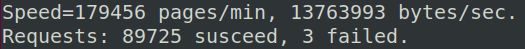
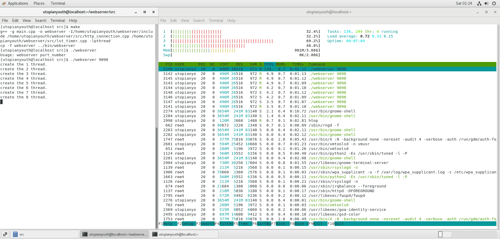
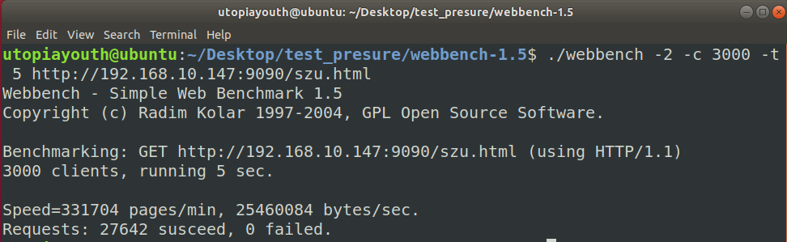
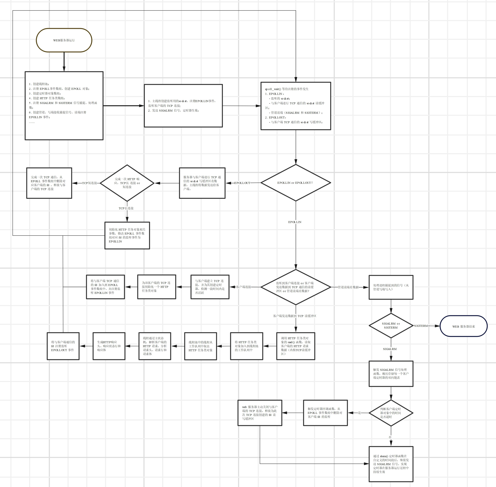

# 轻量级多线程Web服务器

该文档是对 websrver 项目的详细介绍。

## 一、项目启动方法

- 执行 makefile 文件；
- 在 bin 目录下，执行`./webserver port`即可;
- 最后一步就可以在浏览器下访问 resources 文件夹下的资源啦。 

## 二、项目压力测试

### 2.1 压测方法

在本代码仓库中，`test_presure` 文件夹下提供了 `webbench` 压力测试工具，该工具的介绍如下：

> **来源：**Webbench 是 Linux 上一款知名的、优秀的 web 性能压力测试工具，它是由Lionbridge公司开发。
>
> **功能：**测试处在相同硬件上，不同服务的性能以及不同硬件上同一个服务的运行状况；
>
> **运行原理：**Webbench 通过 fork 出多个子进程，每个子进程都循环做 web 服务器的访问测试，子进程测试的结果，通过pipe 告诉父进程，父进程做最终的统计并且显示在终端。  
>
> **运行结果解读**：如下图所示，webbench 会展示服务器的两项指标：每秒钟响应请求数（即QPS）和每秒钟传输的数据量。
>
> <center>
> 	  
> </center>
>
> 其中，Speed 即表示了 QPS，这是最能直接反映服务器并发的性能指标，Requests 表示了对 web 服务器进行 HTTP 请求的成功与失败次数。

通过理解项目压力测试的原理，本人建议 bro 们将压力测试工具在另一个 PC 机上运行，如果直接在服务器上运行的话，由于会创建很多个进程，会影响你的服务器运行 web 程序的性能。

### 2.2 压测结果

首先介绍一下运行该 webserver 的服务器基本性能，cpu 是 2 核 4 线程，内存为 4 GB，在服务器上通过指令 `./webserver 9090`启动我们的 webserver 程序，在另一台 PC 机上执行如下指令，运行 webbench 工具。

```bash
./webbench -2 -c 3000 -t 5 http://your_server_ip:9090/szu.html
# 参数解释：
# -2 表示 TCP 长连接 
# -c 表示对服务器进行 HTTP 请求的客户端数量
# -t 表示对服务器进行 HTTP 请求的持续时长
# 注意：your_server_ip 替换成自己的ip地址，szu.html 为 HTTP 请求的资源
```

运行 webserver 程序的 PC 机如下，其中左边的 Terminal 启动 webserver 程序（可以看到我的线程池大小是 8），右边的 Terminal 通过 `htop` 命令展示了在使用 webbench 进行压力测试时，cpu 和 内存等资源的使用情况：

<center>
  
</center>

另一台主机进行压力测试结束后，显示的结果如下：

<center>
  
</center>

解读：该 webserver 在 3000 个客户端同时发送 HTTP 请求下，并发量能**够达到大约 5~6k 的QPS（结果是上面的 Speed/60）**。

在本介绍的第四章，提供了一些提高并发量的思路，相信随着对网络编程知识和工程能力的积累，会有更多的想法。

## 三、项目宏观的一些碎碎念

该项目是基于 Cpp 开发在 Linux 环境下的轻量级多线程 Web 服务器，利用线程池、IO多路复用、有限状态机、定时器、线程同步等技术，实现处理 HTTP 请求的功能，此外，通过EPOLL事件通知机制和设置 fd 非阻塞的伪异步 IO 模拟 Proactor 事件处理机制，提高服务器的并发性能，达到了 5~6k 的峰值QPS。

### 3.1 Proactor 事件处理机制

Proactor 事件处理机制是 webserver 总体的核心框架，通过分析 Proactor 的流程，有助于理解所使用的技术栈。

> **主线程负责的逻辑：**
>
> - 监听并且处理客户端的 TCP 连接，TCP 连接建立后，在内核中基于 socket 创建 TCP 读写缓冲区，为其 fd 注册 EPOLLIN 事件；
> - 读取 TCP 读缓冲区的内容，为本次客户端的 HTTP 请求创建任务类对象，并且加入到工作队列中，唤醒工作线程；
> - 工作线程处理完 HTTP 请求任务，且对客户端 fd 注册了 EPOLLOUT 事件，当 TCP 写缓冲区可以写数据时，触发 EPOLLOUT 事件，主线程将任务类对象存储的 HTTP 响应数据（在用户区中）写入到 TCP 写缓冲区中，内核 TCP/IP 协议栈将 HTTP 响应数据发送给客户端。
>
> **工作线程负责的逻辑：**
>
> - 从工作队列中取出一个 HTTP 请求任务，解析 HTTP 请求内容，并且通过 HTTP 请求内容生成对应的 HTTP 响应；
> - 修改该 HTTP 请求任务对应客户端的 fd 为 EPOLLOUT，自此，工作线程完成了一个 HTTP 请求任务。

### 3.2 相关技术栈

> - **线程池技术：** 有效解决了在高并发场景下，频繁创建线程处理 HTTP 请求的低效率问题（创建线程需要申请必要的系统资源存储 TCB 等数据）；
> - **IO 多路复用：** 通过 epoll 多路复用和设置 fd 非阻塞，实现 TCP 通信读/写缓冲区的非阻塞 IO，提高服务器的并发效率；
> - **有限状态机：**通过状态转移机制，高效解析客户端发送的 HTTP 请求头、请求行和请求体；
> - **定时器：** 通过对 TCP 连接信息的封装，定义定时器类，一个客户端 TCP 连接对应一个定时器，定时器对象通过双向链表存储，且双向链表是有序的（根据 TCP 连接的有效时间排序），只要进程捕捉到 SIGALRM 信号，就会触发定时器机制，定期检测并且断非活跃的 TCP 连接；
> - **线程同步：** 通过对 Linux 下的互斥锁和信号量进行封装，实现工作线程互斥访问工作队列，同步处理 HTTP 请求任务；
> - **内存映射和分散写：** 将 HTTP 请求的服务器资源从磁盘映射到用户内存区，在 fd 触发 EPOLLOUT 事件后，主线程调用`writev()`分散写，将 HTTP 响应头、状态行和响应体内容从用户内存区拷贝到内核 TCP 写缓冲区中。

为什么说是模拟 Proactor 事件处理机制呢？

该项目主要使用 EPOLL 事件通知机制和设置 fd 非阻塞，接近了异步 IO 的思想，但是仍需要主线程从 TCP 读/写缓冲区（内核）中拷贝和复制数据，不是真正意义上的异步 IO，所以说是模拟，但是该处理机制能够有效提升服务器的并发性能。

### 3.1 webserver 程序运行流程图

下图是 webserver 程序启动之后，处理一次 HTTP 请求，程序的执行流程图（高分辨率图，在 markdown 中不太清晰，如果感兴趣可以下载查看）。

<center>
  
</center>

## 四、项目优化思路

- 第一部分：目前感觉最能尝试的部分是将 web 服务器与客户端通信的 IO 方式改为完全的异步 IO，本项目通过 EPOLL 事件通知机制和设置 fd 非阻塞的伪异步 IO 模拟 Proactor 机制尚且能达到较好的并发量，但是完全异步 IO 实现 Proactor 值得尝试；
- 第二部分：为该 web 服务器添加运行日志功能，毕竟这是一个产品运行最基本的需求；
- 第三个部分：大概就是从功能扩充的角度出发了，目前项目只支持 GET 请求，后续可以增加支持 POST 请求：
  - 这个功能初步实现思路应该和处理 GET 类似，同样复用有限状态机，增加分析 HTTP 请求体的逻辑即可。 